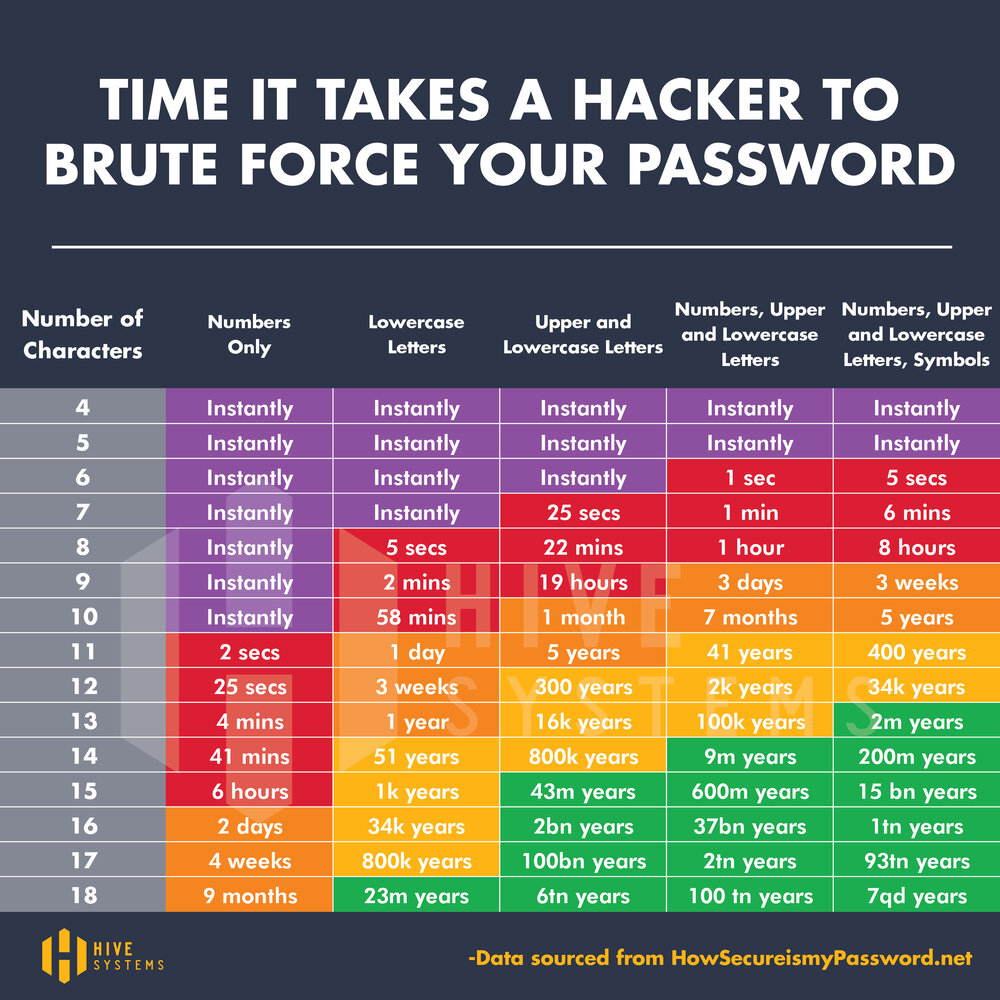

## About

Random password generator and strength checker.

## Requirement

- Python v3 or greater.

## Usage

- Generate password:
```
$ python3 password.py generate
Dd5V9e*D{b5n}
```

- Generate password with custom length:
```
$ python3 password.py generate 15
Q,sNd^7i9gq6&fH
```

- Test password strength:
```
$ python3 password.py test "Q,sNd^7i9gq6&fH"
excellent
```
```
$ python3 password.py test "ABCdef123"
weak
```


